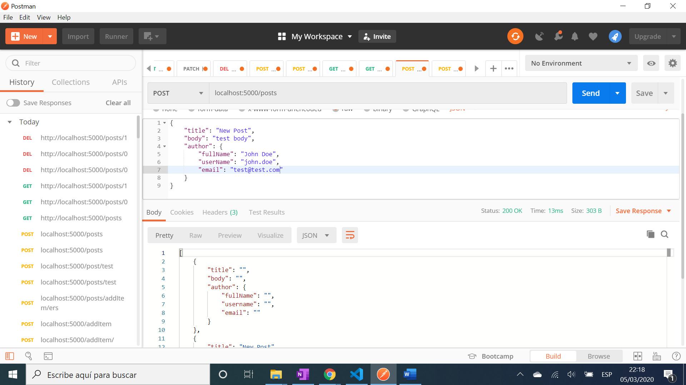

# Golang Http API

Golang JSON REST API using [Gorilla Mux](https://github.com/gorilla/mux) as the HTTP router and URL matcher. Tutorial code from [Devstackr, Youtube video: Build a RESTful HTTP API in Golang w/ Mux](https://www.youtube.com/watch?v=HmiybuiEZI4&t=175s)

## Table of contents

* [General info](#general-info)
* [Screenshots](#screenshots)
* [Technologies](#technologies)
* [Setup](#setup)
* [Features](#features)
* [Status](#status)
* [Inspiration](#inspiration)
* [Contact](#contact)

## General info

* Go’s default request handler signature is `func (w http.ResponseWriter, r *http.Request)`

## Screenshots



## Technologies

* [go version go1.14 windows/amd64](https://golang.org/) programming language
* [Gorilla web toolkit](http://www.gorillatoolkit.org/pkg/mux) HTTP request multiplexer

## Setup

* You need to [download & install Go](https://golang.org/dl/)
* [Set the path of your workspace location in your platform Environment Variables](https://github.com/golang/go/wiki/SettingGOPATH)
* Install [Go in Visual Studio](https://code.visualstudio.com/docs/languages/go)
* Install the Go toolchain in Visual Studio

## Code Examples

* function to get a post using the Gorilla mux, with pointer type *http.Request

```golang
func getPost(w http.ResponseWriter, r *http.Request) {
	// get the ID of the post from the route parameter
	// golang method strconv.Atoi is equivalent to ParseInt(s, 10, 0), converted to type int.
	var idParam string = mux.Vars(r)["id"]
	id, err := strconv.Atoi(idParam)
	if err != nil {
		// there was an error
		w.WriteHeader(400)
		w.Write([]byte("ID could not be converted to integer"))
		return
	}
```

## Features

* [Method to delete post using append slice-manipulation](https://github.com/golang/go/wiki/SliceTricks#delete)

## Status & To-do list

* Status: Working 

* To-do: comment code

## Inspiration

* All code from [Devstackr, Youtube video: Build a RESTful HTTP API in Golang w/ Mux](https://www.youtube.com/watch?v=HmiybuiEZI4&t=175s)
* [Hugo Johnsson: Medium article REST-API with Golang and Mux](https://medium.com/@hugo.bjarred/rest-api-with-golang-and-mux-e934f581b8b5)
* [Go Web Examples: Routing (using gorilla/mux)](https://gowebexamples.com/routes-using-gorilla-mux/)

## Contact

Repo created by [ABateman](https://www.andrewbateman.org) - feel free to contact me!
